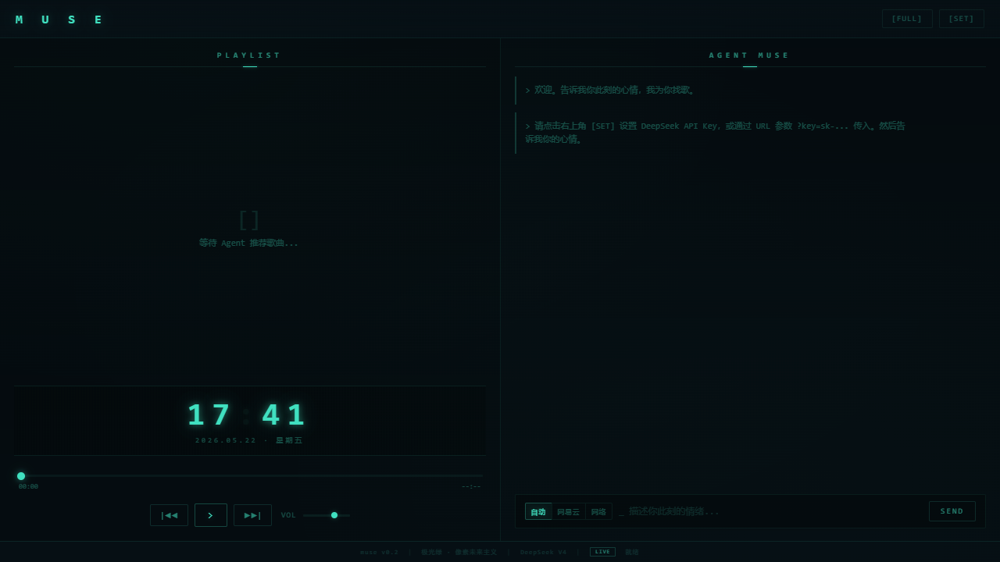

# 🎵 Muse Player

> **面向大学生情绪陪伴与音乐发现的 AI 互动音乐体验平台**
>

---

## 💡 一句话简介

用自然语言描述你的心情，AI 理解你的情绪，从多个音乐平台为你找到最合适的歌曲 —— 无需切换 App，一个浏览器标签页就够了。

---

## 🎯 痛点

- 大学生面临学业压力、社交焦虑、睡眠问题，音乐是最常用也是最经济的情绪调节工具
- 但传统音乐 App 需要用户**主动搜索**歌名/歌手，心情不好时根本不知道该搜什么
- 跨平台搜歌耗时：网易云没有就去QQ，QQ没有就去酷狗，反复切换
- 听歌是孤独的：缺少轻量级的音乐共听和情绪表达空间

## ✨ 解决方案

Muse Player 把"情绪 → 音乐"的路径缩短到一句话：

```
用户: "今天下雨了，一个人在宿舍，有点emo"
  ↓
AI 分析情绪 → 生成搜索关键词 → 网易云/酷狗/QQ/酷我聚合搜索
  ↓
返回推荐卡片 → 一键播放 → 弹幕式共听体验
```

---

## 🚀 核心功能

| 功能 | 说明 |
|------|------|
| **🗣️ 情绪输入** | 用自然语言描述心情、场景、风格，不需要精确的搜索词 |
| **🤖 AI 音乐推荐** | DeepSeek V4 分析情绪意图，生成推荐歌单，解释推荐理由 |
| **🔍 多平台聚合搜索** | 网易云 → 酷狗 → QQ音乐 → 酷我，自动回退，不用手动切换 |
| **📻 弹幕共听** | Canvas 弹幕层：当前歌曲歌词 + 网友情绪故事从右飘过 |
| **📱 PWA 轻量部署** | 浏览器打开即用，可添加到桌面，无需安装 App |
| **🎨 极光绿像素风** | Aurora Teal `#40e0c0` 像素复古未来主义，独特的视觉识别 |
| **🔧 Demo Mode** | 无后端环境下自动启用模拟数据，评委打开即体验 |

---

## 🏗️ 技术架构

```
┌─────────────────────────────────────────────┐
│              浏览器 (index.html)              │
│  ┌──────────┐ ┌──────────┐ ┌─────────────┐  │
│  │ UI 渲染层 │ │ Agent 层  │ │ Canvas 弹幕层│  │
│  │ (CSS GRID)│ │(DeepSeek) │ │ (歌词+故事)  │  │
│  └─────┬────┘ └────┬─────┘ └──────┬──────┘  │
│        │           │              │          │
│  ┌─────┴───────────┴──────────────┴──────┐   │
│  │          音乐源适配层                    │   │
│  │  网易云 API  │ 酷狗 │ QQ音乐 │ 酷我     │   │
│  └─────────────┬─────────────────────────┘   │
└────────────────┼────────────────────────────┘
                 │
    ┌────────────┴────────────┐
    │  本地 API 代理服务        │
    │  NeteaseCloudMusicApi    │  ← 端口 3000
    │  lx-music-api-server     │  ← 端口 9000
    └─────────────────────────┘
```

- **前端**: 纯 HTML/CSS/JS，单文件，零构建工具
- **AI**: DeepSeek V4 Flash (Chat + Web Search)
- **音乐源**: 网易云 + 酷狗 + QQ音乐 + 酷我（多级回退）
- **部署**: 静态文件，GitHub Pages / Vercel / 任何 HTTP 服务器

---

## 🎬 AI 工作流程

```
用户输入情绪/场景
  → DeepSeek 理解意图 + 情绪标签
  → 生成结构化搜索关键词（歌曲名 + 歌手）
  → 多平台并行/串行搜索（带匹配分数过滤）
  → Agent 生成推荐理由 + 美化推荐卡片
  → 用户播放/跳过 → 反馈优化下一轮推荐
```

---

## 📸 界面预览



**左面板**: 歌单列表 · 像素时钟 · 播放控件
**右面板**: Agent 对话 · 推荐卡片（PLAY 按钮）
**弹幕层**: Canvas 实时渲染，歌词 + 情绪故事飘过

---

## 🚀 快速开始

### 线上体验（推荐）
> 直接访问 GitHub Pages 链接即可体验 Demo Mode

### 本地完整运行

```bash
# 1. 启动网易云音乐 API 代理
npx -y NeteaseCloudMusicApi

# 2. 启动多平台 URL 解析服务
cd lx-api-server && pip install -r requirements.txt && python main.py

# 3. 打开应用
# 浏览器打开 index.html，或运行:
start launch-muse.bat   # Windows
```

### Demo Mode
当本地 API 不可用时，应用自动切换到 Demo Mode，使用内置模拟数据展示完整交互流程。评委无需配置任何后端即可体验。

---

## 📁 项目结构

```
muse-player/
├── index.html           # 主应用（单文件）
├── manifest.json        # PWA 配置
├── favicon.svg          # 网站图标
├── icons/               # PWA 图标 + 截图
├── lx-api-server/       # 多平台 URL 解析服务（Python）
├── docs/                # 设计文档 + 参赛说明
├── archive/             # 历史预览原型（不提交）
├── launch-muse.bat      # Windows 一键启动
├── package.json         # npm 依赖
├── package-lock.json    # 依赖锁文件（可复现安装）
└── .gitignore
```

---

## ⚖️ 合规声明

- **版权**: 本平台定位为"音乐发现与推荐入口"，不存储、不缓存、不分发任何商业音乐文件。Demo Mode 使用 Web Audio API 合成示例音景 + 模拟曲库，仅用于展示推荐、播放、弹幕和交互流程。
- **AI**: 使用 DeepSeek API，用户自行提供 API Key，平台不上传、不存储用户数据。
- **第三方代码**: `lx-api-server/` 基于 [MeoProject/lx-music-api-server](https://github.com/MeoProject/lx-music-api-server) (MIT License)，许可证见 `lx-api-server/LICENSE`。
- **隐私**: 全部数据存储在浏览器 localStorage，无服务端数据库，无用户追踪。

---

## 📄 许可证

本项目代码采用 MIT License。第三方组件许可证见各子目录。
